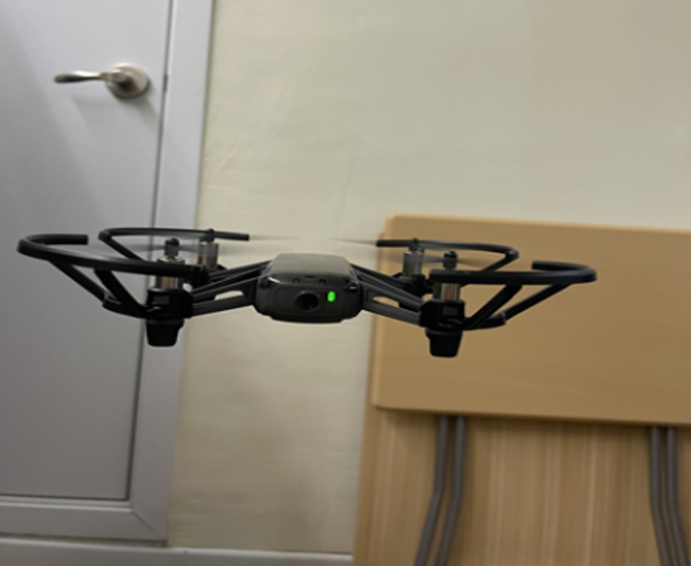
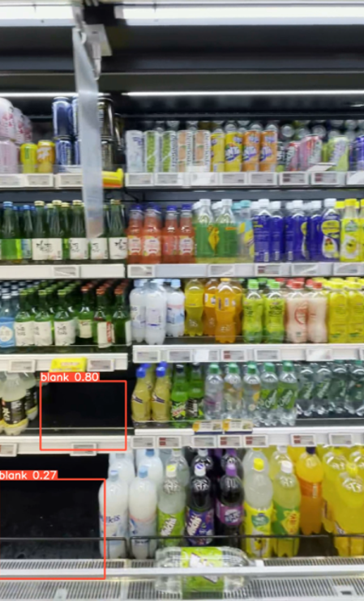

# AI 드론을 활용한 매장관리 프로젝트 - 입선

2022 한이음 프로젝트
Object Detect 기능을 탑재한 드론이 매장을 자율 주행하며 매대에 비어있는 상품이 발생하면 
모바일 App에 알람을 주어 직원이 매장에 상품을 진열 할 수 있도록 도움을 줌

<table>
  <tr>
    <td style="text-align: center;">주행 중인 드론 모습/td>
    <td style="text-align: center;">드론이 촬영한 진열대 모습</td>
  </tr>
  <tr>
    <td></td>
    <td></td>
  </tr>
</table>

## 주요 기능

*   **자율 주행 및 경로 이동**: Tello 드론이 미리 정의된 경로 (`command.txt`)를 따라 자율적으로 비행합니다.
*   **객체 인식 (사람 및 빈 공간 감지)**: PyTorch 딥러닝 모델을 사용하여 비행 중 사람과 빈 공간(선반의 빈 곳 등)을 실시간으로 감지합니다.
*   **이미지 촬영 및 전송**: 감지된 객체 또는 주요 지점에서 이미지를 촬영하고, 촬영된 이미지를 중앙 서버로 전송합니다.
*   **실시간 영상 스트리밍**: 드론 카메라의 영상을 안드로이드 앱에서 실시간으로 확인할 수 있는 기능을 제공합니다.
*   **원격 매장 관리 (안드로이드 앱)**:
    *   드론이 촬영한 이미지들을 갤러리 형태로 확인합니다.
    *   이미지 확인 후, 상품 채움 상태(예: 채우는 중, 완료, 미채움)를 업데이트하고 서버에 전송하여 매장 관리 작업을 지원합니다.
    *   드론 상태 및 로그를 확인할 수 있습니다.

## 기술 스택

*   **드론 제어 및 AI**:
    *   Python
    *   DJITelloPy: Tello 드론 제어 라이브러리
    *   PyTorch: 딥러닝 모델 실행 (객체 감지)
    *   OpenCV: 이미지 처리 및 영상 분석
*   **백엔드 서버**:
    *   Python
    *   Socket 프로그래밍 (UDP 기반 커스텀 프로토콜): 앱-서버 간 통신
*   **모바일 애플리케이션**:
    *   Java
    *   Android SDK
*   **데이터 형식**:
    *   이미지: PNG, BMP
    *   명령어: 텍스트 파일 (`command.txt`)

## 프로젝트 아키텍처

본 프로젝트는 크게 세 가지 주요 구성 요소로 이루어져 있습니다:

1.  **드론 유닛 (Tello Drone)**:
    *   Python 스크립트를 통해 제어되며, 지정된 경로를 비행합니다.
    *   카메라를 통해 영상을 입력받고, PyTorch 모델을 이용해 객체(사람, 빈 공간)를 감지합니다.
    *   주요 지점에서 스냅샷을 촬영합니다.
    *   `Drone/main/Server.py`를 통해 통신 기능을 수행할 수 있습니다 (앱 서버 또는 다른 모듈과의 직접 통신 가능성).

2.  **중앙 서버 (App Server - `App/python/Server.py`)**:
    *   드론 및 안드로이드 앱 사이의 데이터 중계를 담당합니다.
    *   UDP 기반의 자체 프로토콜을 사용하여 이미지 데이터, 상태 업데이트 등을 수신하고 전달합니다.
    *   촬영된 이미지와 관련된 메타데이터(상태 등)를 관리합니다.

3.  **클라이언트 애플리케이션 (Android App)**:
    *   사용자 인터페이스를 제공하여 드론의 실시간 스트리밍 영상을 보여줍니다.
    *   서버로부터 수신한 이미지들을 갤러리 형태로 표시하고, 사용자가 각 이미지의 상태(상품 채움 여부 등)를 관리할 수 있도록 합니다.
    *   네트워크 매니저를 통해 중앙 서버와 통신합니다.

## 시연
**Live URL**: [https://youtu.be/xEdc1I79DqM](https://youtu.be/xEdc1I79DqM)

## 프로젝트 실행 방법
프로젝트를 실행하기 위한 간략한 절차는 다음과 같습니다 (세부 설정 필요):

1.  **드론 실행**:
    *   `Drone/main/weights/` 경로에 `best_blank.pt`와 `best_person.pt` 모델 파일이 준비되어야 합니다.
    *   `Drone/main/command.txt` 파일에 드론 비행 경로 명령어를 작성합니다.
    *   `Drone/main/main.py` 스크립트를 실행하여 드론을 이륙시키고 작업을 시작합니다.

2.  **중앙 서버 실행**:
    *   `App/python/Main.py` 스크립트를 실행하여 안드로이드 앱과의 통신을 준비합니다. (서버 IP 주소 등 네트워크 설정 확인 필요)

3.  **안드로이드 앱 실행**:
    *   안드로이드 스튜디오를 통해 `App/Android/` 프로젝트를 빌드하고 기기에 설치합니다.
    *   앱 실행 후 중앙 서버에 연결하여 드론의 영상 스트리밍을 확인하고, 촬영된 이미지들을 관리합니다. (앱 내 서버 IP 주소 등 네트워크 설정 확인 필요)
